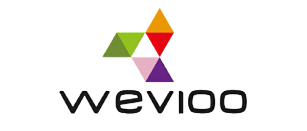
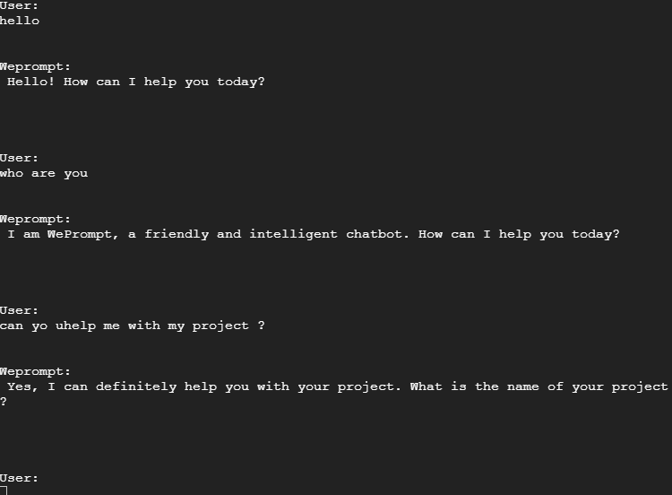
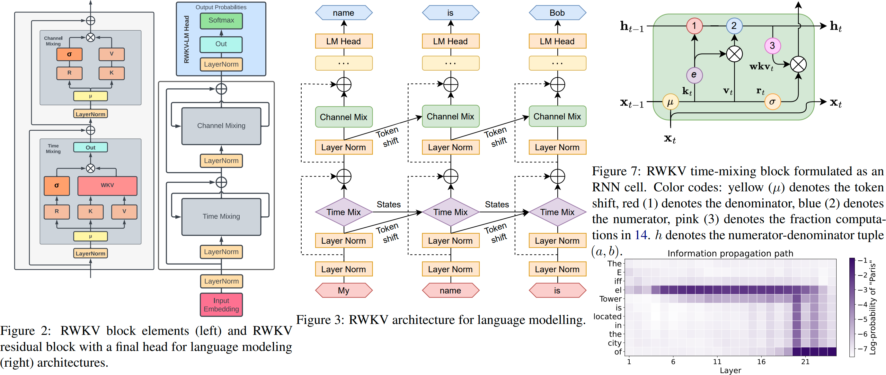

</a> 
</a> 


## WePromt 1.0
WePrompt is a text generative model that can be an SQLAdvisor, a ProjectAdvisor and more  ! 

## Directory structure :
├───RavenApi                                                                                              
│   20B_tokenizer.json                                                                                    
│   convert_model.py                                                                                      
│   RavenApi.py                                                                                           
│   RavenCloud.py                                                                                         
│   weprompt.ipynb                                                                                        
│                                                                                                         
├───instructions                                                                                          
│       ProjectAdvisor.py                                                                                 
│       SQLAdvisor.py                                                                                     
│                                                                                                         
└───users                                                                                                 

### RavenApi folder :

20B_tokenizer.json : model's tokenizer
convert_model : strategy model converter for better and faster model loading
RavenApi : the Raven model as an API 
RavenCloud : interact with the raven model with the CLI 
weprompt.ipynb : a jupyter notebook to run the model , the terminal is needed.

### instructions folder :

ProjectAdvisor: initial prompt that will guide the model to be a ProjectAdvisor
SQLAdvisor: initial prompt that will guide the model to be a SQLAdvisor
restrict the model to a certain use allows you to controle it.
### users folder :

contains users directory with subdirectories for their conversations.

## Project Explanation :


## Prerequirments
Python 3.4+
Virtualenv
pip

## Installation
```
apt-get install -y git
```

```
git clone https://github.com/kimou6055/WePrompt.git
```
All of the following will be built into a virtualenv

open the cmd in the root folder
do : 
```
cd ../

```

Then do the follow:
linux :
```
sudo apt-get update
sudo apt-get install python3-venv
python3 -m venv myenv

```
windows : 
```
pip install virtualenv
python -m venv myenv

```
Then activate the environnement

windows : 
```
venv\Scripts\activate
```


linux : 
```
source venv/bin/activate
```
Make sure you have Python 3.x installed on your machine. You can install the required Python libraries by running:

```
pip install rwkv
pip install torch
pip install pynvml
pip install fastapi
pip install pydantic
pip install mysql
pip install ninja

```
you can dowload the RAVEN V12 14B Params from this [Link](https://huggingface.co/BlinkDL/rwkv-4-raven/resolve/main/RWKV-4-Raven-14B-v12-Eng98%25-Other2%25-20230523-ctx8192.pth)

Make sure to put the model in the RavenApi folder


Make sure to install CUDA : 
 [Linux](https://docs.nvidia.com/cuda/cuda-installation-guide-linux/)
 [Windows](https://docs.nvidia.com/cuda/cuda-installation-guide-microsoft-windows/)

## Usage
To use cuda acceleration please do : 

linux: 

```
export PATH=/usr/local/cuda/bin:$PATH
export LD_LIBRARY_PATH=/usr/local/cuda/lib64:$LD_LIBRARY_PATH
```

windows:

Install VS2022 build tools (https://aka.ms/vs/17/release/vs_BuildTools.exe select Desktop C++). Reinstall CUDA 11.7 (install VC++ extensions). Run v2/chat.py in "x64 native tools command prompt". 


### RavenAPI
To use :

```
cd WePrompt/RavenApi
```

```
python RavenApi.py
```

Then send a POST request at this address: http://localhost:8000/generate-response

in this syntax : 
```
{
  "user_message": " summarize our last conversation  ",
  "user_id": "22",
  "discussion_id": "4",
  "prompt_file": "ProjectAdvisor"
}

```
the response will be as the follow : 
```
{
    "generated_text": " Sure, here's a summary of our conversation:\n1. I created a new file called `Home.js` and added some basic HTML and CSS to it.\n2. I created a new file called `index.js` and added some basic code to it, including a function that sends a request to the MySQL database using the `axios` library.\n3. I created a new file called `App.js` and added some basic code to it, including a function that renders the Home component using the `ReactDOM.render()` method.\n4. I created a new file called `index.css` and added some basic styles to it, including a logo and some basic styling for the page\n\n"
}
```
You can use ProjectAdvisor or SQLAdvisor 

PS : choose the proper strategy for your own hardware configuration while loading the RWKV model in RavenCloud.py or RavenApi.py


you can see other options [HERE](https://github.com/BlinkDL/ChatRWKV/blob/main/ChatRWKV-strategy.png)

RWKV python implementation can be found [HERE](https://pypi.org/project/rwkv/)

Hyperparameters of RWKV can be found in the actions.py file
### RavenCloud

```
cd WePrompt/RavenApi
python RavenApi.py
```
Then you can interact with the model directly through the terminal.

</a> 

## Performance 

The 7B model performs greatly on google collab's nvidia v100 and tesla T4 , it consumes 20 GB ram to load then 16 GB Vram.
The strategy used was cuda fp16 using the first layer on cpu, the layers 2->33 on gpu.

The 14B model perfoms well on vast.ai instance 2X RTX 4000 , it consumes 30GB ram to load then 32 gb Vram.
The stratgy used was cuda 0:fp16 -> cuda 1:fp16 using the first layer on cpu, the layers 2->16 on gpu 1 and the layers 17 -> 33 on gpu 2 .

## Why Raven ? 

RWKV sounds like an impressive language model developed by BLINKDL that combines the strengths of both RNN and Transformer architectures. By blending these two approaches, RWKV achieves results similar to a Transformer-based language model, providing high performance while being directly trainable in a manner similar to a GPT-style Transformer (parallelizable).

One notable advantage of RWKV is that it is entirely attention-free, meaning it does not rely on self-attention mechanisms that are typically resource-intensive. Instead, to calculate the hidden state at position t+1, RWKV only requires the hidden state at position t. This design choice leads to efficient memory usage, making it particularly suitable for NV-RAM (Non-Volatile Random Access Memory) environments.

Additionally, by utilizing the "GPT" mode, it becomes possible to quickly compute the hidden state for the "RNN" mode. This further enhances training speed and efficiency.

Overall, RWKV appears to offer exceptional performance, reduced NV-RAM memory usage, fast training, and the potential for an "infinite" ctx_len (context length). This combination of features makes it a promising and powerful language model.
### RWKV definition 

RWKV is an attention mechanism used in the context of language models, particularly in Transformers. It stands for:

R - Reference (Référence in French): The letter "R" represents the linear reference. The reference is calculated by linearly combining elements of the sequence using learned weights. It serves as a point of reference for evaluating the importance of other elements in the sequence when calculating attention scores.

W - Weights (Poids in French): The letter "W" refers to the weights used to linearly combine the elements of the sequence to calculate the reference. These weights are learned during the model training and are used to assign relative importance to each element of the sequence when constructing the linear reference.

K - Key (Clé in French): The letter "K" represents the keys associated with the elements of the sequence. Keys are used to measure the similarity between each element of the sequence and the linear reference. Attention scores are calculated by comparing the keys with the reference.

V - Value (Valeur in French): The letter "V" represents the values associated with the elements of the sequence. Values correspond to the information that needs to be aggregated or represented when calculating attention. They are weighted by the attention scores and aggregated to form the final attention representation.

In summary, RWKV is a method of calculating attention in a Transformer model, where a reference is derived from the sequence elements using learned weights (W) and compared to the keys (K) to compute attention scores. The corresponding values (V) are then combined based on these attention scores to produce the final attention representation. This mechanism allows the model to focus on relevant parts of the input sequence during processing.

### RWKV  better than QKV

Reduced Complexity: RWKV Linear-Attention can be more computationally efficient compared to QKV-Attention, as it uses a linear reference instead of a combination of queries, keys, and values. This can be advantageous in terms of execution speed and resource utilization.

Capturing Long-Distance Dependencies: RWKV Linear-Attention is designed to better capture long-distance dependencies in a sequence. By using a linear reference, it can consider more complex relationships between elements, which can be beneficial in tasks where long-distance relationships are crucial.

Reduction of Positional Bias: In QKV-Attention, queries and keys may be sensitive to the position of elements in the sequence, leading to positional bias. RWKV Linear-Attention, with its linear reference, can reduce this bias and improve the model's robustness.


</a> 

### Raven Architecture

</a> 

### Conclusion 
[Here](https://www.canva.com/design/DAFl0PMO1Fc/D1k7EG1VMgPtTtLGnIJnuA/edit?utm_content=DAFl0PMO1Fc&utm_campaign=designshare&utm_medium=link2&utm_source=sharebutton) is a canva presentation

## possibilities 

finetuning the model with custom data.